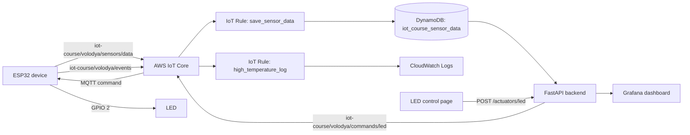

# IoT Course HW6

HW6 connects an ESP32, AWS IoT Core, DynamoDB, FastAPI, Grafana, and a small LED control page.

## Architecture



Sensor data moves from the device to AWS and then to the API and Grafana. LED commands move in the opposite direction from the web page to the device.

## Repository layout

- `device/` - ESP32 PlatformIO project and Wokwi circuit.
- `fast_api/` - FastAPI backend and LED control page.
- `dashboard/` - exported Grafana dashboard.

## AWS resources

Region: `eu-central-1`.

| Resource | Name |
| --- | --- |
| IoT Thing | `esp32-volodya` |
| IoT Policy | `esp32-volodya-policy` |
| IoT data endpoint | `a3uy4feb9m7i98-ats.iot.eu-central-1.amazonaws.com` |
| Sensor MQTT topic | `iot-course/volodya/sensors/data` |
| LED command MQTT topic | `iot-course/volodya/commands/led` |
| Device event MQTT topic | `iot-course/volodya/events` |
| IoT Rule | `save_sensor_data` |
| IoT Rule | `high_temperature_log` |
| DynamoDB table | `iot_course_sensor_data` |
| CloudWatch log group | `/iot-course/high-temperature` |
| Backend IAM user/profile | `fastapi-backend` |

The DynamoDB table uses `sample_time` as a Number partition key and uses on-demand billing.

## MQTT and IoT Policy

The device uses MQTT over TLS on port `8883`.

The device policy must allow these operations:

- connect as `esp32-volodya`;
- publish sensor data;
- subscribe to and receive LED commands;
- publish LED confirmation events.

Use this policy shape. Replace `<account-id>` with the AWS account ID.

```json
{
  "Version": "2012-10-17",
  "Statement": [
    {
      "Effect": "Allow",
      "Action": "iot:Connect",
      "Resource": "arn:aws:iot:eu-central-1:<account-id>:client/esp32-volodya"
    },
    {
      "Effect": "Allow",
      "Action": "iot:Publish",
      "Resource": [
        "arn:aws:iot:eu-central-1:<account-id>:topic/iot-course/volodya/sensors/data",
        "arn:aws:iot:eu-central-1:<account-id>:topic/iot-course/volodya/events"
      ]
    },
    {
      "Effect": "Allow",
      "Action": "iot:Subscribe",
      "Resource": "arn:aws:iot:eu-central-1:<account-id>:topicfilter/iot-course/volodya/commands/led"
    },
    {
      "Effect": "Allow",
      "Action": "iot:Receive",
      "Resource": "arn:aws:iot:eu-central-1:<account-id>:topic/iot-course/volodya/commands/led"
    }
  ]
}
```

Attach the policy and the Thing to the same active device certificate.

## IoT Rules

### `save_sensor_data`

SQL:

```sql
SELECT *
FROM 'iot-course/volodya/sensors/data'
```

DynamoDB action:

- table: `iot_course_sensor_data`;
- operation: `INSERT`;
- partition key field: `sample_time`;
- partition key value: `${timestamp()}`;
- partition key type: `NUMBER`;
- payload field: `device_data`;
- service role: `iot_dynamodb_role`;
- Error Action: none configured.

### `high_temperature_log`

SQL:

```sql
SELECT *
FROM 'iot-course/volodya/sensors/data'
WHERE temperature > 28
```

CloudWatch Logs action:

- log group: `/iot-course/high-temperature`;
- service role: `iot_cloudwatch_logs_role`;
- batch mode: disabled;
- Error Action: none configured.

## Backend IAM permissions

The FastAPI backend reads DynamoDB and publishes LED commands to AWS IoT Core.

The `fastapi-backend` IAM identity needs at least:

```json
{
  "Version": "2012-10-17",
  "Statement": [
    {
      "Effect": "Allow",
      "Action": "dynamodb:Scan",
      "Resource": "arn:aws:dynamodb:eu-central-1:<account-id>:table/iot_course_sensor_data"
    },
    {
      "Effect": "Allow",
      "Action": "iot:Publish",
      "Resource": "arn:aws:iot:eu-central-1:<account-id>:topic/iot-course/volodya/commands/led"
    }
  ]
}
```

The `iot:Publish` resource must match `iot-course/volodya/commands/led`, because that is the topic used by `fast_api/main.py`.

## Device configuration

Requirements:

- PlatformIO;
- ESP32 DevKit target;
- Wi-Fi access;
- AWS IoT device certificate and private key;
- Amazon Root CA 1.

Create the local secrets file:

```bash
cd device
cp include/secrets.h.example include/secrets.h
```

Edit `include/secrets.h` and set:

- `WIFI_SSID`;
- `WIFI_PASSWORD`;
- `AWS_ROOT_CA`;
- `AWS_DEVICE_CERT`;
- `AWS_PRIVATE_KEY`.

`include/secrets.h` is ignored by Git. Do not commit the private key.

Build the firmware:

```bash
cd device
pio run
```

For Wokwi, `wokwi.toml` uses the firmware and ELF files from `.pio/build/esp32dev/`.

The device uses:

- GPIO `2` for the LED;
- serial speed `115200`;
- MQTT TLS port `8883`.

## FastAPI configuration

Requirements:

- Python `3.13+`;
- `uv`;
- AWS credentials that can use the backend IAM permissions.

Defaults in `fast_api/main.py`:

| Setting | Default |
| --- | --- |
| `AWS_PROFILE` | `fastapi-backend` |
| `AWS_REGION` | `eu-central-1` |
| `SENSOR_TABLE_NAME` | `iot_course_sensor_data` |

Configure the backend profile if it does not exist:

```bash
aws configure --profile fastapi-backend
```

Run the API on port `8000`:

```bash
cd fast_api
uv sync
uv run fastapi dev main.py --host 0.0.0.0 --port 8000
```

Useful URLs:

- `http://localhost:8000/` - LED control page;
- `http://localhost:8000/sensors/latest` - latest sensor sample;
- `http://localhost:8000/sensors/history?minutes=30` - sensor history;
- `POST http://localhost:8000/actuators/led` - LED command API.

Example LED command:

```bash
curl -X POST http://localhost:8000/actuators/led \
  -H 'Content-Type: application/json' \
  -d '{"state":"on"}'
```

## Grafana

Import `dashboard/New dashboard-1789853993666.json` into Grafana.

The dashboard uses the Grafana Infinity data source and relative API paths:

- `/sensors/history?minutes=30`;
- `/sensors/latest`.

Configure the Infinity data source base URL as:

```text
http://localhost:8000
```

The exported dashboard refers to the original data source UID. When importing it into another Grafana instance, map the dashboard queries to the local Infinity data source if Grafana asks for a data source.

This repository does not start or configure a Grafana server.

## Setup from zero

1. Select AWS region `eu-central-1`.
2. Create DynamoDB table `iot_course_sensor_data` with Number partition key `sample_time` and on-demand billing.
3. Create IoT Thing `esp32-volodya`.
4. Create and activate a device certificate. Attach the Thing and `esp32-volodya-policy` to it.
5. Configure `esp32-volodya-policy` with the scoped MQTT permissions shown above.
6. Create `save_sensor_data` and its DynamoDB service role.
7. Create `high_temperature_log`, its CloudWatch Logs service role, and log group `/iot-course/high-temperature`.
8. Create IAM identity/profile `fastapi-backend` with the DynamoDB and IoT permissions shown above.
9. Copy `device/include/secrets.h.example` to `device/include/secrets.h` and add the Wi-Fi and certificate values.
10. Build and run the ESP32 firmware.
11. Run FastAPI on port `8000`.
12. Import the Grafana dashboard and point its Infinity data source at `http://localhost:8000`.
13. Open `http://localhost:8000/` and send ON/OFF commands.

## Verification

Check the sensor path:

```bash
curl http://localhost:8000/sensors/latest
curl 'http://localhost:8000/sensors/history?minutes=30'
```

Check the control path:

```bash
curl -X POST http://localhost:8000/actuators/led \
  -H 'Content-Type: application/json' \
  -d '{"state":"off"}'
```

Then confirm:

- the ESP32 receives the command;
- GPIO 2 changes the LED state;
- the device publishes a confirmation to `iot-course/volodya/events`;
- Grafana reads current data from the FastAPI endpoints.
